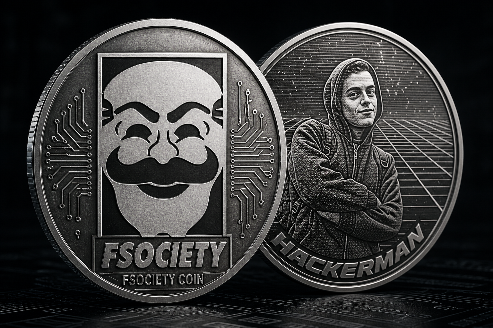
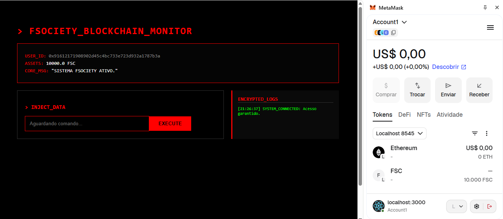
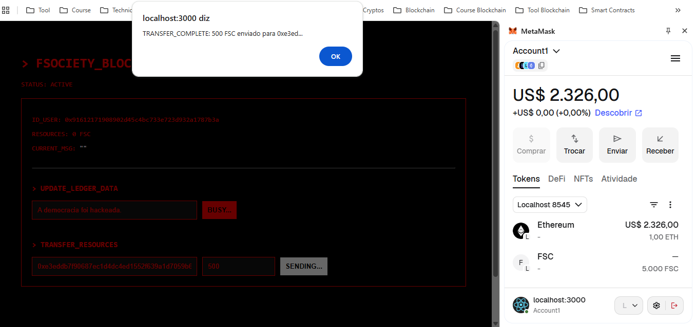
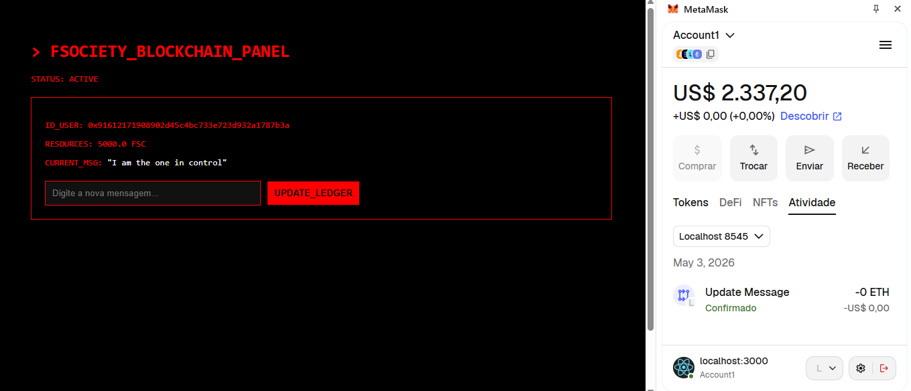

# FSOCIETY BLOCKCHAIN MONITOR

> "Our democracy has been hacked. Control is an illusion."



Este repositório contém um ecossistema **Web3 Full Stack** completo, operando com a **Fsociety Coin (FSC)**. O projeto foi desenvolvido em ambiente isolado (WSL2) e integra contratos inteligentes de governança e ativos digitais.
 

---

## PROVA DE CONCEITO (SCREENSHOTS)

Abaixo estão os registros reais da operação do sistema, integrando o nó da blockchain com a interface de usuário.

### 1. Painel Operacional & Monitoramento de Logs

*Visualização do terminal com saldo de **10.000 FSC** e monitor de logs ativos.*

### 2. Protocolo de Transferência de Recursos

*Execução confirmada de envio de ativos FSC entre identidades da rede.*

### 3. Interação com o Smart Contract (MetaMask)

*Interface de assinatura digital e validação de transações via carteira descentralizada.*

---

## ARQUITETURA DO SISTEMA
- **Fsociety Coin (FSC):** Token ERC-20 desenvolvido com padrões OpenZeppelin para segurança máxima.
- **Ledger Message:** Contrato inteligente para registro imutável de mensagens na rede.
- **Frontend Interativo:** Terminal em React.js que "ouve" a blockchain em tempo real (auto-polling).
- **CI/CD:** Pipeline automatizado no GitHub Actions para validação de código e contratos.

## INICIALIZAÇÃO DO PROTOCOLO

1. **Inicie o nó da fsociety:**
   ```bash
   truffle develop --host 0.0.0.0
   ```
2. **Execute o deploy dos contratos:**
   ```bash
   truffle(develop)> migrate --reset
   ```
3. **Inicie o Dashboard:**
   ```bash
   cd frontend && npm start
   ```

---
_Status: **SECURE DECENTRALIZED ACTIVE**_
